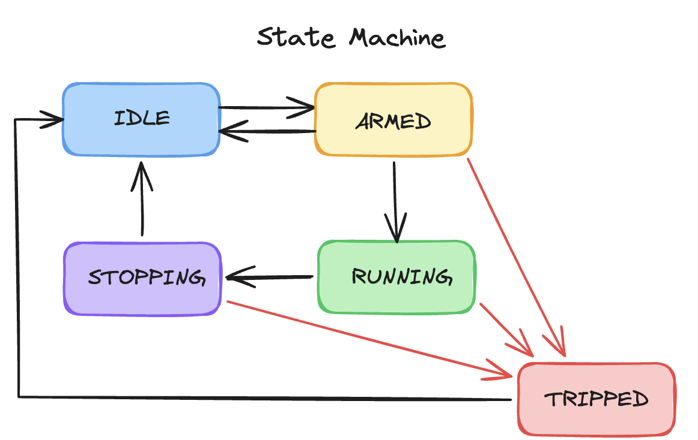

# E-Axle Dynamometer Test Stand

Manual-control software for a small-scale E-Axle drivetrain dynamometer,
built on [Nominal Connect](https://github.com/nominal-io/connect) and
[Instro](https://github.com/nominal-io/instro).

## What is this

The E-Axle stand demonstrates Nominal's data-acquisition and control
products against a real automotive-style powertrain test rig: the same
class of equipment automotive manufacturers use for end-of-line testing,
life-cycle testing, powertrain characterization, calibration, and NVH work.

The physical stand is a small go-kart-class E-Axle drivetrain (a 48V/1kW
BLDC motor, 9.5:1 gearbox, and open differential) loaded by two independent
dyno absorber motors, all three driven by CAN-connected motor controllers on
one bus, powered by a bidirectional DC supply that both sources and sinks
bus current. See [Hardware overview](#hardware-overview) below for exact
part numbers and specs.

This repository holds the **manual-control core**: the operator state
machine, the 13 safety interlocks, and the hardware driver layer. It does
not yet include the operator-facing application (the Connect app itself).
See [Status](#status) below.

## Status

**Implemented and tested** (115 tests, all passing against real Instro
driver objects, no simulated shortcuts):

- `interlocks.py`: 13 trip conditions (overspeed, overvoltage,
  over-temperature, torque dropout, differential speed spread, staleness,
  and more), transcribed from the stand's commissioned limits.
- `units.py`: the unit conversions (gear ratio, pole-pair scaling, torque
  constant) needed to compare raw telemetry against those limits.
- `session.py`: the operator-facing state machine: arm, command speed,
  command brake, stop, trip, and recover. Owns the tick loop, the telemetry
  cache, and the safety-critical command ordering described below.
- `stand.py`: the hardware driver layer, wrapping Instro's real motor
  controller and power supply objects.

**Not yet built:** the Connect application itself (`app.connect`,
`main.py`) that would let an operator drive this from a UI. Wiring that up
(constructing the real Instro objects, injecting them into `HardwareStand`,
and exposing `StandSession`'s methods as UI controls) is tracked as an open
task. Until then, this project is verified entirely by its test suite.

## Hardware overview

| Component | Part | Notes |
|---|---|---|
| Device under test | TDPRO TK204 + TD525 | 48V/1kW E-Axle: BLDC motor + 9.5:1 gearbox + open differential |
| Dyno absorbers (×2) | MP 8055 BLDC outrunner | 50 Kv, Hall-sensored, independently commanded |
| Motor controllers (×3) | VESC FSESC 75200 | One per DUT/absorber; homogeneous, one CAN encoding for all three |
| Power supply | EA PSB 10080-60 | 48V bidirectional DC supply, 80V/60A/1500W; sources *and* sinks bus current |
| CAN bus | 500 kbit/s, 29-bit extended IDs | Node IDs: DUT 0, absorber-L 1, absorber-R 2 |

Full detail (wiring, safety interlocks, commissioning data, and the stand's
own operating manual) lives in `reference/`: the operating manual is
[`e-axle-dyno_user_manual_rev_1-0.md`](reference/e-axle-dyno_user_manual_rev_1-0.md),
and `reference/tooling software/` holds the three commissioning scripts
(`comms_check.py`, `dut_step_test.py`, `dyno_test.py`) this design was
verified against.

## Concept of operations

An operator drives the stand through `StandSession`'s state machine:



(states are IDLE, ARMED, RUNNING, STOPPING, and TRIPPED)

1. **Arm.** `arm()` succeeds only once telemetry is fresh from all three
   nodes, the PSU is enabled, and no interlock is currently tripped.
2. **Run.** `set_speed_setpoint_erpm()` ramps the drive motor toward a
   target speed (rate-limited, resent every tick to hold the controllers'
   firmware watchdog). `set_brake_current_a()` applies a clamped,
   instant-on regenerative braking current to both absorbers together.
3. **Stop.** `stop()` begins a graceful shutdown: brake current ramps to
   zero *first*, and only once it reaches zero does speed begin ramping
   down. This ordering is structural, not a race. See
   [Safety-critical implementation notes](#safety-critical-implementation-notes).
4. **Trip.** Any of 13 interlocks (overspeed, overvoltage, over-temperature,
   torque dropout, excessive differential speed spread, stale telemetry, or
   an operator disabling the PSU mid-run) immediately zeroes the machine and
   latches the stand in `TRIPPED`. An operator dismisses this with
   `acknowledge_trip()`, but re-arming re-checks the same interlocks: a
   trip that hasn't cleared will refuse to arm again.

Every tick (`StandSession.tick(dt)`) drains fresh telemetry, evaluates all
active interlocks, and issues whatever commands the current state calls
for: this is the loop a future operator UI would drive at a fixed rate
(the existing test suite runs it at 50 Hz).

## Installation

Requires Python 3.11+ (developed and tested on 3.14) and
[`uv`](https://github.com/astral-sh/uv). Dependencies (`instro`,
`instro-unstable>=1.10.0` for the VESC6 motor-controller driver, `python-can`,
`pytest`) are declared in `pyproject.toml` and resolved from PyPI — no
worktree or branch install needed:

```bash
uv sync
```

The core (`interlocks.py`, `units.py`, `session.py`, `stand.py`) needs
nothing beyond the standard library: they're deliberately free of any
`instro` import at module load time. Only the test suite needs the
`instro`/`instro-unstable` packages that `uv sync` installs.

## First run

```bash
uv run pytest tests/ -v
```

All 115 tests should pass. This includes one full feature test
(`tests/test_trip_and_recovery.py`) that exercises the real Instro object
graph (a shared CAN transport, three motor controllers, and a PSU) with
only the physical CAN bus and VISA session mocked out; everything above
that boundary is real, production code.

No live-hardware entry point exists yet (see [Status](#status)).
Connecting this to the physical stand means building `main.py`/`app.connect`
(the composition root that constructs real Instro driver objects: the CAN
adapter, node IDs, and PSU network address all get set there) and injecting
them into `HardwareStand`, per the
dependency-injection pattern the code already follows. `interlocks.LIMITS`
in `interlocks.py` holds every configurable safety threshold (current
limits, overspeed thresholds, temperature limits, timing) and is the
first place to look before changing any trip behavior.

## Repository layout

```
interlocks.py   13 safety interlocks + the commissioned limits (LIMITS)
units.py        unit conversions between telemetry and the interlocks' units
session.py      the operator state machine and tick loop
stand.py        the hardware driver layer (wraps Instro's real objects)
tests/          115 tests, including the one end-to-end feature test
reference/      stand manual (.md) and commissioning scripts (tooling software/)
```

## Development

- Run tests: `pytest tests/`
- Lint: `ruff check .`

## Safety-critical implementation notes

Rationale for the safety-critical behavior in `session.py`/`stand.py`. Code
comments point here instead of repeating this inline.

### Watchdog / command resend

The VESC controllers' firmware auto-releases the motor ~1000ms after the last
command frame. Instro has no periodic-transmit facility of its own, so
`StandSession.tick()`'s unconditional per-tick resend of `commanded_erpm` /
`commanded_brake_a` while ARMED/RUNNING *is* the mechanism holding a setpoint
against that watchdog. It must never be gated on "did the value change":
skipping a resend because nothing changed is exactly what lets the watchdog
expire.

### STOP sequencing: brake before speed

Commanded speed must never fall while brake current is still nonzero:
releasing the drive motor while the absorbers are still regen-braking is the
inversion interlock 13 exists to forbid.

This is enforced structurally, not by timing: `tick()`'s STOPPING branch is an
if/elif/else on the freshly-ramped brake value computed *that* tick, and the
code that can touch speed is lexically unreachable while `commanded_brake_a >
0.0`. Speed can begin falling on the same tick brake first reaches exactly
zero, never before it. `HardwareStand.zero_all()`'s trip-path order follows
the same rule: absorbers are zeroed before `mdc.stop_motor()`.

### ⚠️ Speed resend during brake bleed-off (needs hardware confirmation)

While STOP is bleeding brake current to zero (up to ~10s at 20A / 2A/s),
`tick()` resends the operator's *unchanged* speed setpoint rather than going
silent, so the drive motor's watchdog doesn't release it mid-bleed-off. An
unchanged value can't make speed fall, so this doesn't weaken the
brake-before-speed invariant above.

**Software-verified only.** Unconfirmed: does a VESC FSESC 75200 in speed
control *hold* when it receives a `SET_RPM` equal to its current
setpoint while its regen load bleeds off, rather than re-latching or reacting
badly? Confirm on the bench before trusting this under load. If reverted,
also update the two hard per-tick assertions in
`tests/test_trip_and_recovery.py`'s Act 1.

Status: shipped, pending hardware confirmation.

### Trip evaluation: fixed order and action

Fixed, first-wins order (design.md §2): node staleness (all 3) → DUT overspeed
→ dyno overspeed (both absorbers) → bus overvoltage (per node) → FET temp (per
node) → motor temp (per node) → speed-tracking error → dropout (per absorber)
→ spread. The order determines which reason an operator sees when two
conditions are true on the same tick.

Runs only in ARMED/RUNNING/STOPPING, immediately after the telemetry drain and
before any command is computed or sent that tick: a trip discovered this tick
must block this tick's commands, not the next one's.

On trip: zero the machine inline, bypassing every ramp → latch `session.trip`
→ state = TRIPPED → clear commanded values and the operator's own setpoints →
reset every duration accumulator → send nothing this tick.

`check_spread`'s `above_floor_for_s` parameter doesn't mean "duration of
divergence" the way its name implies. Rather than change the already-tested
`interlocks.py` function, `session.py` accumulates "time both above the floor
AND diverged beyond the threshold" itself and passes that in.

### Freshness gating (interlock 12)

Every field-based interlock read (rows 2-9) is gated on freshness: a field
older than `LIMITS.freshness_s`, or never seen at all, is skipped for *that
check only* (not the whole tick), and `freshness_skips` increments. This
applies generally across all of rows 2-9, not only `bus_voltage`.

### Recovery

`acknowledge_trip()` is TRIPPED -> IDLE only, a no-op otherwise (same guard
style as `arm()`/`disarm()`/`stop()`). It clears `session.trip` and moves the
state; it does not re-check the fault. Coupling dismissal to the fault would
let an operator staring at a trip banner on a controller that takes minutes
to cool get stuck unable to clear their own screen. The protection belongs
at arming, where the machine is about to move, not at acknowledgement.

`can_arm()`'s two trip-aware terms, ANDed with its existing three: no trip is
latched, and a fresh, side-effect-free re-check of the six *instantaneous*
checks (§2 rows 1-6: staleness, both overspeeds, overvoltage, both
temperatures) against the current cache finds nothing. The three
duration-accumulating checks (rows 7-9: speed-tracking, dropout, spread) are
not re-checked here: their accumulators are reset to `0.0` on leaving an
active state, so from IDLE there is nothing accumulated to check; evaluating
them would just be evaluating zeroed accumulators and calling it a check.

### Dropout interlock uses unsigned current

Interlock 7 reads `abs(motor_current)`, not the signed value. The sign
convention for regen current is unverified against real hardware: feeding
the signed value risks a guaranteed nuisance trip on the first loaded run.

### PSU disable mid-run never disables output

The operator "disable PSU" affordance never calls `output_enable(False)`
while the session is active. Confirmed from the real EA PSB driver source:
source and sink quadrants share one physical `OUTP` relay, so disabling
output is the same command as cutting the sink path while the dynos are
still braking: regenerated energy would have nowhere to go.

Instead, disabling the PSU while ARMED/RUNNING/STOPPING forces a trip
(`Trip(reason="psu_disabled", node=None)`; not one of the 13 `check_*`
interlocks, since this is a direct operator action rather than a sensed
condition, but latched and recovered through the exact same path). The trip
path commands the bus to 0V (`HardwareStand.zero_bus_voltage()`) rather than
disabling output, keeping the regulation loop, and therefore the sink,
alive.

`zero_bus_voltage()` is called unconditionally on every disable, regardless of
state, including IDLE and TRIPPED, where no trip is forced (nothing to
protect, or already latched) but the bus is still taken to 0V. Enabling
(`enabled=True`) is unaffected in every state: it still calls
`stand.set_psu_output_enabled(True)` (the safe direction) and does not clear a
latched trip or restore bus voltage.

**Needs hardware confirmation:** does the PSB's control loop genuinely keep
sinking at a 0V setpoint with output enabled? This is verified from the
driver's source/architecture, not an observed physical trial.

### Instro API quirks `HardwareStand` absorbs

- `InstroMotorController.stop()` only stops the background telemetry daemon:
  the real motor-stop is `stop_motor()`.
- `get_telemetry()` returns Instro's `Measurement` publish-wrapper
  (name-prefixed keys), not a plain dict; unwrapped in `get_telemetry()`.
- `InstroPSU` has no `set_output_enabled`; the real method is
  `output_enable(enable, channel)`. This stand has exactly one PSU channel.
- Three VESC6 drivers share one `CanTransport`: whichever opens first constructs
  the actual bus, whichever closes last tears it down. `HardwareStand`
  never constructs a second one.

### `disarm()` is deliberately narrow

`disarm()` only handles ARMED → IDLE. It is not extended to
RUNNING/STOPPING/TRIPPED: a broader "abort from any state" could let an
operator bypass the brake-before-speed ordering above without itself doing
any zeroing. Aborting an active run goes through `stop()`; clearing a trip
goes through `acknowledge_trip()`.
