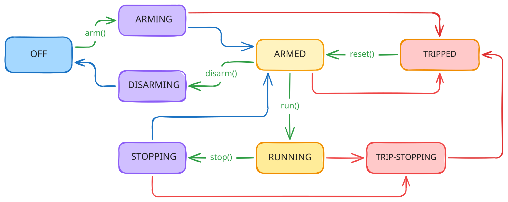

# E-Axle Dynamometer Stand

Control software for a real, CAN-connected bench-scale regenerative dynamometer used for electric axle characterization. The `e-axle` library is interface-first in its design. The channel primitives, configuration, and the safety-oriented state machine are built and fully tested against real driver APIs before any turnkey automation or UI is layered on top.

## `e-axle` library
`e-axle` is the python library containing all interface, control, and system constraint constants to be relied upon by further packages. It primarily provides the `EAxleStand`, `EAxleStandConfig`, `EAxleStandState`, and their required inputs to begin interacting with the specific hardware.

## Hardware being controlled

- **`dut`**: the device-under-test motor controller (VESC6), torque/speed/current commanded.
- **`left_load` / `right_load`**: two absorber motor controllers (VESC6) acting as regenerative brakes. Current-commanded only.
- **`source`**: the source quadrant of a bidirectional EA PSB10000 supply. Bus voltage/current, output enable, and hardware OVP/OCP limits.
- **`sink`**: the sink quadrant of the same physical unit, run in CV mode to absorb regen current at the held bus voltage.

See `reference/e-axle-dyno_user_manual_rev_1-0.md` for the full hardware design, wiring, and operating envelope this code is built against.

## State machine



`arm()` is a thin wrapper for `open()` and `disarm()` is a thin wrapper for `close()`. A motor controller's CAN connection can't be meaningfully "open but unpowered," since the controllers need bus power to boot and respond. Connecting and powering up collapse into one step.

## Concept of operations

A typical session:

1. Construct `EAxleStand.from_drivers(config, ...)` and use it as a context manager. `with EAxleStand(config) as stand:` calls `open()`, which connects every instrument, powers the bus, and confirms all three motor controllers have booted, landing in `ARMED`. The plain constructor, `EAxleStand(config, ...)` takes pre-built `Motor`/`Source`/`Sink` objects and is *not* preferred over the aforementioned `EAxleStand.from_drivers(config, ...)` method. Both are provided for testing purposes.
2. While `ARMED`, stage the test: set `control_mode` and the relevant `torque`/`speed`/`current` setpoint on `dut`/`left_load`/`right_load`. These writes never reach the hardware yet.
3. Call `run()` to actually begin commanding. State moves to `RUNNING`, and the staged setpoints start being transmitted continuously.
4. Adjust setpoints live while `RUNNING` to sweep through the test.
5. Call `stop()` to ramp every motor back to zero and return to `ARMED`, ready to stage and run another test, or `disarm()`.
6. `disarm()` (or exiting the `with` block) powers down the source and disconnects every instrument, returning to `OFF`.

Fault handling needs no operator action to detect. Any monitored channel going out of range fires immediately. If nothing was running, the stand just marks itself `TRIPPED`. If a motor could have been moving, `_trip_stop()` runs at once and zeroes everything. From `TRIPPED`, `reset()` re-checks every channel before allowing a return to `ARMED`, and it refuses if the underlying condition hasn't cleared.

An abnormal exit (an exception mid-test, a crashing script) is also handled. `close()`, and therefore the `with` block's teardown, works from any state and never raises, so the bus and every instrument end up safe and disconnected regardless of how the session ended.

The E-stop remains the actual safety device for a real emergency. None of the above is a substitute for it.

## Safety design

Per the manual, the external E-stop is the only true safety device on this stand. Everything below is a software convenience layered on top of it, not a substitute for it.

- Every `Monitorable` channel's `measured` setter fires its `on_trip` delegate the instant a new value is out of range, on whatever thread happened to take that measurement (typically an instrument's own background daemon thread). `_wire_trip_delegates()` points every channel's `on_trip` at `EAxleStand._on_trip()`.
- `_on_trip()` reacts based on the current state. If nothing is actively running (`ARMED`/`ARMING`), it just marks the stand `TRIPPED`. If a motor could be moving (`RUNNING`/`STOPPING`), it runs the full `_trip_stop()` sequence.
- `_trip_stop()` is idempotent. A `threading.Lock` guards only the tiny "check state, claim `TRIP_STOPPING`" section at its top, not the whole method, so a second concurrent trip (e.g. two channels tripping on two different instruments' daemon threads at once) bails out immediately instead of running the shutdown sequence twice. It commands every motor to `0.0` directly (never a configured `default`, which need not be zero) and disables both `source` and `sink` before settling into `TRIPPED`. It never raises, even if the wait for confirmation times out.
- `close()` never raises either, from any starting state. It's the one teardown path `__exit__` depends on when an exception propagates out of a `with EAxleStand(...) as stand:` block, so it must always finish disconnecting rather than leave hardware in an unmanaged state.

## Reference material

- `reference/e-axle-dyno_user_manual_rev_1-0.md`: the hardware design, theory of operation, and operating envelope this code implements against.
- `reference/tooling software/`: the prior ad hoc scripts (`dyno_test.py`, `comms_check.py`, `dut_step_test.py`) this rebuild is superseding.

## Development

This repo uses `just` and `uv` to handle building, checking, formatting, etc. The primary entrypoint is the top-level `justfile` which can delegate to the `e-axle/justfile` directly.

From `e-axle`, use any of the following (or `just`):
```sh
just all        # check, lint, format, test
just check      # ty
just lint       # ruff check
just format     # ruff format
just test       # pytest
```

and from the root prepend the commands with `e-axle` like: `just e-axle lint`.

